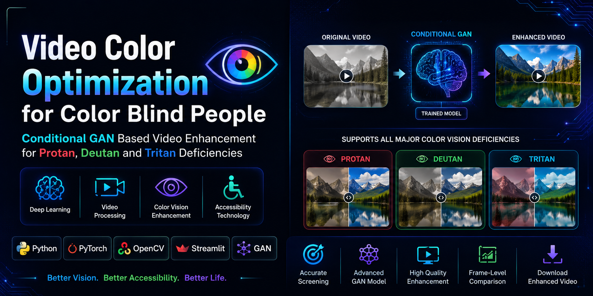
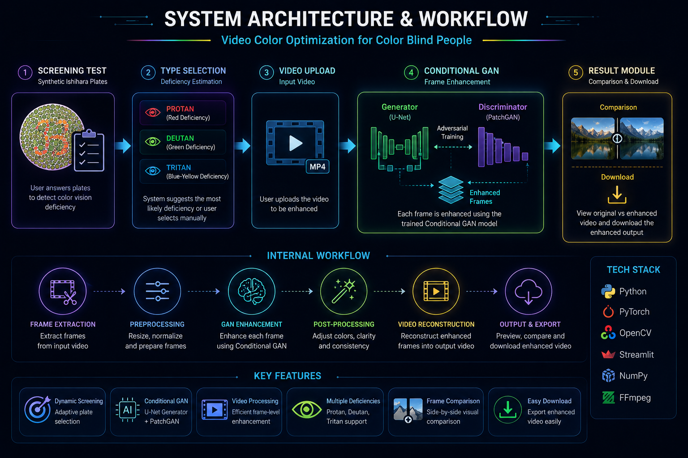
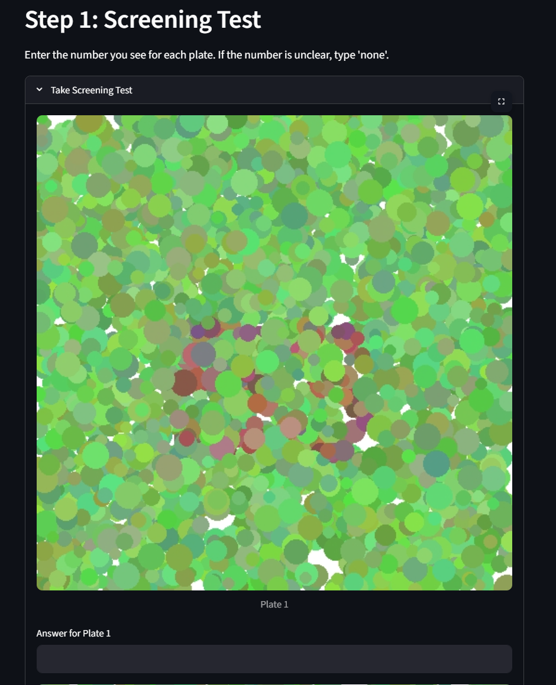
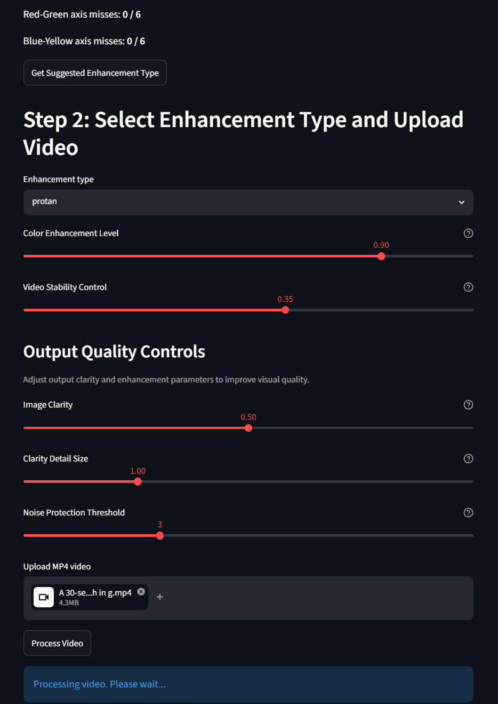
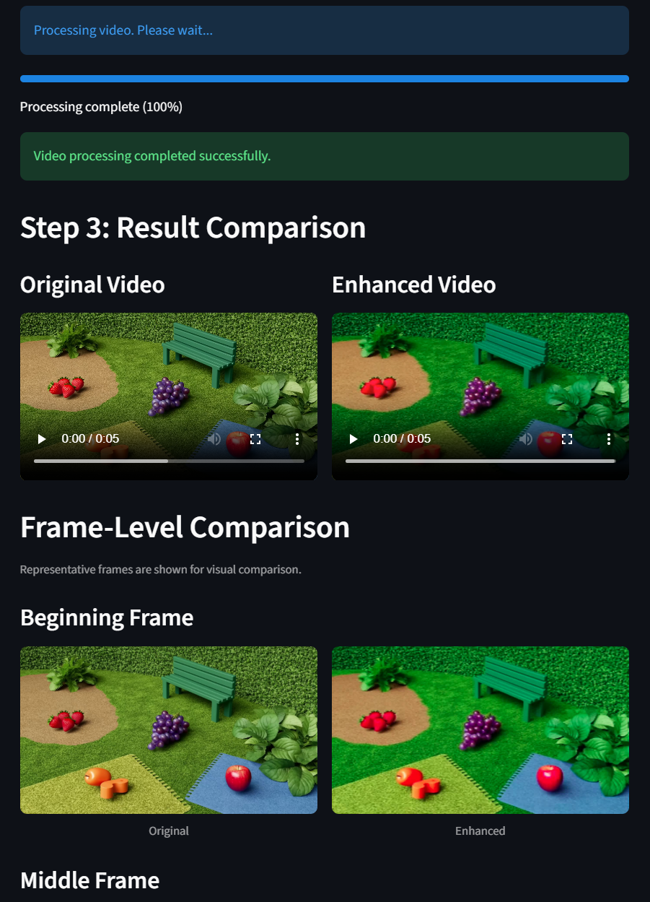
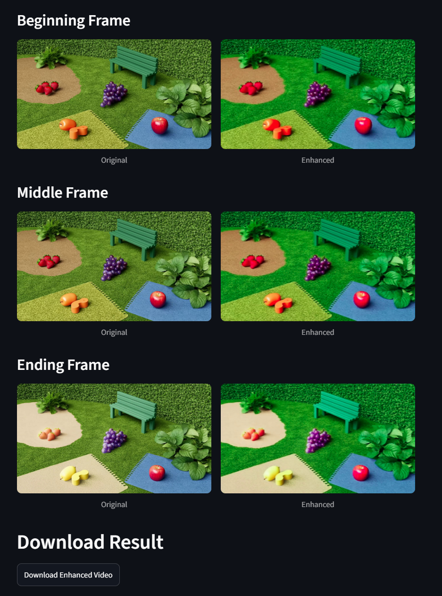

# Video Color Optimization for Color Blind People using Conditional GAN

<p align="center">
  
</p>

<p align="center">
  
  
  
  
  
</p>

---

## Project Overview

A deep learning-based video enhancement system that improves color distinguishability for people with **Color Vision Deficiency (CVD)** using a **Conditional Generative Adversarial Network (cGAN)**.

The application provides a lightweight screening test, suggests an enhancement mode, processes uploaded videos frame-by-frame, and generates an optimized output video while preserving visual realism.

The system supports:

- Protan (Red deficiency)
- Deutan (Green deficiency)
- Tritan (Blue-Yellow deficiency)

---

## Project Highlights

- Conditional GAN based video enhancement pipeline
- U-Net Generator and PatchGAN Discriminator
- Dynamic Ishihara-style screening test
- Randomized screening plate generation
- CSV-based answer synchronization
- Frame-by-frame video enhancement
- Temporal smoothing to reduce flickering
- LAB color-space enhancement
- Adjustable sharpening controls
- Original vs Enhanced video comparison
- Frame-level comparison
- Browser-compatible MP4 playback
- Downloadable enhanced video output
- Streamlit-based interactive user interface

---

## Application Screenshots

### System Architecture & Workflow

<p align="center">
  
</p>

### Screening Test

<p align="center">
  
</p>

### Upload & Enhancement Controls

<p align="center">
  
</p>

### Original vs Enhanced Video

<p align="center">
  
</p>

### Frame-Level Comparison

<p align="center">
  
</p>

---

## Features

### Color Vision Deficiency Support

The system supports three major color vision deficiency types:

- Protan
- Deutan
- Tritan

### Dynamic Screening Test

- Synthetic Ishihara-style screening plates
- Red-Green and Blue-Yellow axis evaluation
- Automatic enhancement type suggestion
- One-click generation of new randomized screening tests
- CSV-based answer synchronization

### Video Enhancement Pipeline

- Upload MP4 videos
- Frame-by-frame enhancement using Conditional GAN
- Temporal smoothing to reduce flickering
- LAB color-space enhancement
- Adjustable enhancement strength
- Adjustable sharpening controls

### Result Visualization

- Side-by-side video comparison
- Original vs Enhanced preview
- Frame-level comparison
  - Beginning frame
  - Middle frame
  - Ending frame
- Download enhanced video

---

## System Architecture

<p align="center">
  
</p>

### Workflow Summary

```text
Screening Test
      ↓
Deficiency Estimation
      ↓
Type Selection
      ↓
Video Upload
      ↓
Conditional GAN
      ↓
Frame Enhancement
      ↓
Video Reconstruction
      ↓
Result Comparison
      ↓
Download Output
```

---

## Project Workflow

### Step 1 – Screening Test

The user answers synthetic Ishihara-style plates.

### Step 2 – Deficiency Estimation

The application analyzes mistakes on:

- Red-Green plates
- Blue-Yellow plates

and suggests an enhancement type.

### Step 3 – Type Selection

The user may:

- Accept the suggested type
- Manually select Protan, Deutan, or Tritan

### Step 4 – Video Upload

The user uploads an MP4 video.

### Step 5 – Video Processing

Each frame is:

- Extracted
- Resized
- Conditioned with the selected CVD type
- Passed through the trained Conditional GAN

### Step 6 – Enhancement

Additional processing includes:

- Temporal smoothing
- LAB color enhancement
- Edge sharpening

### Step 7 – Result Generation

Enhanced frames are reconstructed into a processed video.

### Step 8 – Comparison

The application displays:

- Original vs Enhanced Video
- Representative Frame Comparisons

### Step 9 – Download

The enhanced video can be downloaded locally.

---

## Technology Stack

### Frontend: Streamlit

Used for:

- User Interface
- Screening Test
- Video Upload
- Progress Tracking
- Comparison Dashboard
- Download Functionality

**Why used:** Streamlit allows rapid development of machine learning applications using only Python, without requiring a separate frontend framework.

### Backend: Python 3.10

Used for:

- Application Logic
- Video Processing
- Inference Pipeline
- File Management
- Screening Logic

**Why used:** Python has strong support for deep learning, computer vision, image processing, and rapid prototyping.

### Deep Learning: PyTorch

Used for:

- Conditional GAN
- U-Net Generator
- PatchGAN Discriminator
- GPU Acceleration
- Checkpoint Loading
- Model Inference

**Why used:** PyTorch provides flexible neural network development, automatic differentiation, and CUDA-based GPU acceleration.

### Computer Vision: OpenCV

Used for:

- Video Reading
- Frame Extraction
- Frame Resizing
- Color Conversion
- Video Writing

**Why used:** OpenCV is reliable and efficient for frame-level video processing.

### Image Processing: Pillow (PIL)

Used for:

- Synthetic Plate Generation
- Image Rendering
- Plate Visualization
- Drawing Text and Shapes

### Numerical Computing: NumPy

Used for:

- Matrix Operations
- Pixel Processing
- Image Masks
- Array Manipulation

### Video Encoding: imageio-ffmpeg

Used for:

- Browser-compatible MP4 generation
- Streamlit video playback support
- H.264 compatible video conversion

### Version Control & Model Distribution

**Git and GitHub** are used for source code management, version control, project documentation, and portfolio hosting.

**Kaggle** is used for pretrained model checkpoint hosting and large model file distribution.

---

## Project Structure

```text
CVD-Video-Color-Optimization/
│
├── app/
│   ├── app.py
│   ├── generate_synthetic_plates.py
│   └── plates/
│
├── checkpoints/
│   └── enhance_gan_conditional/
│       └── latest.pth
│
├── dataset/
│
├── demo/
│   ├── banner.png
│   ├── architecture_workflow.png
│   ├── screening_test.png
│   ├── upload_controls.png
│   ├── video_comparison.png
│   └── frame_comparison.png
│
├── inference/
│   └── video_pipeline.py
│
├── preprocessing/
│
├── simulate/
│
├── training/
│
├── utils/
│
├── outputs/
│
├── README.md
├── requirements.txt
└── requirements-lock.txt
```

---

## Folder Description

### app/

Contains:

- Streamlit application
- Screening test logic
- User interface
- Synthetic plate generation

Important files:

- `app.py`: Main application entry point.
- `generate_synthetic_plates.py`: Generates randomized screening plates and updates the plate configuration.

### checkpoints/

Stores pretrained model checkpoints.

Expected model path:

```text
checkpoints/enhance_gan_conditional/latest.pth
```

Model checkpoints are not stored directly in GitHub because they are large. The checkpoint must be downloaded separately from Kaggle.

### inference/

Contains the runtime video enhancement pipeline.

`video_pipeline.py` is responsible for:

- Loading the trained model
- Reading input video
- Extracting frames
- Running Conditional GAN inference
- Applying post-processing
- Writing enhanced output video

### preprocessing/

Contains dataset preprocessing utilities used for resizing raw images and preparing 256×256 training data.

### simulate/

Generates enhancement targets used during training, including color deficiency simulation and LAB color-space based enhancement target creation.

### training/

Contains the GAN architecture, training pipeline, loss functions, and training scripts.

### utils/

Contains shared helper functions and checkpoint utilities.

### outputs/

Stores generated enhanced videos locally.

---

## Model Architecture

### Conditional GAN

A Conditional GAN is used because the output enhancement depends on the selected deficiency type:

- Protan
- Deutan
- Tritan

The model receives both the video frame and the CVD type condition.

### Generator: U-Net Generator

Advantages:

- Encoder-decoder architecture
- Skip connections
- Better detail preservation
- Stable image reconstruction
- Suitable for image-to-image translation

**Why U-Net:** U-Net preserves important spatial details while allowing the model to transform image colors intelligently.

### Discriminator: PatchGAN Discriminator

Advantages:

- Evaluates local image patches
- Improves texture realism
- Preserves local details
- Helps generate sharper outputs

**Why PatchGAN:** PatchGAN checks whether small image regions look realistic instead of judging only the full image.

---

## Training Configuration

| Parameter | Value |
|---|---|
| Dataset Size | 15,000 Images |
| Resolution | 256×256 |
| Epochs | 40 |
| Batch Size | 6 |
| Learning Rate | 0.0002 |
| Optimizer | Adam |
| Generator | U-Net |
| Discriminator | PatchGAN |
| Framework | PyTorch |
| Supported Types | Protan, Deutan, Tritan |

---

## Performance Summary

| Component | Implementation |
|---|---|
| Deep Learning Framework | PyTorch |
| GAN Architecture | Conditional GAN |
| Generator | U-Net |
| Discriminator | PatchGAN |
| Optimizer | Adam |
| Video Processing | OpenCV |
| Video Encoding | ImageIO-FFMPEG |
| Interface | Streamlit |
| Screening Test | Dynamic Synthetic Plates |
| Output | Enhanced MP4 Video |

---

## Key Technical Contributions

### Dynamic Screening Module

Implemented synthetic Ishihara-style plate generation with randomized answers to reduce memorization and improve flexibility.

### Conditional GAN Enhancement Pipeline

Designed a video enhancement pipeline using a trained Conditional GAN to improve color distinguishability for users with CVD.

### Temporal Video Stabilization

Implemented temporal smoothing to reduce frame-to-frame flickering during inference.

### Browser-Compatible Video Reconstruction

Integrated ImageIO-FFMPEG to ensure generated videos can be played directly inside Streamlit and modern browsers.

### Interactive Comparison Dashboard

Developed comparison modules including:

- Original vs Enhanced Video
- Beginning Frame Comparison
- Middle Frame Comparison
- Ending Frame Comparison

---

## Installation

### Clone Repository

```bash
git clone https://github.com/Lelouch-Lamperouge2004/CVD-Video-Color-Optimization.git
cd CVD-Video-Color-Optimization
```

### Create Virtual Environment

```bash
python -m venv .venv
```

Activate on Windows:

```bash
.\.venv\Scripts\activate
```

### Install Dependencies

```bash
pip install -r requirements.txt
```

### Install PyTorch

CUDA version:

```bash
pip install torch torchvision torchaudio --index-url https://download.pytorch.org/whl/cu121
```

CPU version:

```bash
pip install torch torchvision torchaudio --index-url https://download.pytorch.org/whl/cpu
```

### Install FFmpeg Wrapper

```bash
pip install imageio-ffmpeg
```

---

## Download Pretrained Model

Download the checkpoint from Kaggle:

```text
https://www.kaggle.com/datasets/lelouchlamperouge69/cvd-pretrained-cgan-model-for-vc-optimization
```

Place the file at:

```text
checkpoints/enhance_gan_conditional/latest.pth
```

Final expected structure:

```text
checkpoints/
└── enhance_gan_conditional/
    └── latest.pth
```

---

## Running the Application

Generate screening plates:

```bash
python app/generate_synthetic_plates.py
```

Run Streamlit:

```bash
streamlit run app/app.py
```

Open in browser:

```text
http://localhost:8501
```

---

## Running Direct Inference

```bash
python -m inference.video_pipeline \
  --ckpt checkpoints/enhance_gan_conditional/latest.pth \
  --in_video input.mp4 \
  --out_video output.mp4 \
  --type protan
```

Supported types:

- protan
- deutan
- tritan

---

## Optional Training Pipeline

### Step 1 – Resize Dataset

```bash
python -m preprocessing.resize_to_256 \
  --src dataset/coco_raw \
  --dst dataset/original_256 \
  --limit 15000
```

### Step 2 – Generate Enhancement Targets

```bash
python -m simulate.enhance_target \
  --in_dir dataset/original_256 \
  --out_dir dataset/enh_targets_256 \
  --limit 15000
```

### Step 3 – Train Conditional GAN

```bash
python -m training.train_enhance_gan \
  --x_dir dataset/original_256 \
  --y_dir dataset/enh_targets_256 \
  --out_dir checkpoints/enhance_gan_conditional \
  --limit 15000 \
  --epochs 40 \
  --batch 6 \
  --lr 0.0002 \
  --lambda_l1 100 \
  --lambda_id 10 \
  --lambda_gan 1 \
  --seed 123
```

---

## Challenges Addressed

| Challenge | Solution |
|---|---|
| No real paired training dataset | Synthetic enhancement targets using LAB color space |
| Video flickering | Temporal smoothing |
| Soft GAN outputs | Sharpening controls |
| Browser video compatibility | ImageIO-FFMPEG encoding |
| Fixed screening answers | Randomized plate generation |
| Large checkpoint size | Kaggle checkpoint hosting |

---

## Evaluation Metrics

The project uses visual and quantitative evaluation.

### Mean Absolute Difference

Measures how much the output image changes compared to the input.

### Saturation Gain

Measures whether color intensity and distinguishability improved.

### Edge Gain

Measures whether object boundaries and visual details are preserved.

These metrics help evaluate whether the model improves color visibility while maintaining image realism.

---

## Future Improvements

- Real-time webcam enhancement
- Mobile application deployment
- User-specific adaptive enhancement
- Clinical validation with CVD participants
- Cloud deployment
- Larger and more diverse training datasets
- AR/VR integration for assistive vision

---

## Skills Demonstrated

- Deep Learning
- Generative AI
- Conditional GANs
- Computer Vision
- Video Processing
- Streamlit Development
- PyTorch
- OpenCV
- Dataset Engineering
- Model Inference
- GPU Acceleration
- Software Engineering
- Git and GitHub

---

## Author

**Aditya Dnyandeo Ingale**

Final Year Computer Science Engineering Project

**Video Color Optimization for Color Blind People using Conditional GAN**
